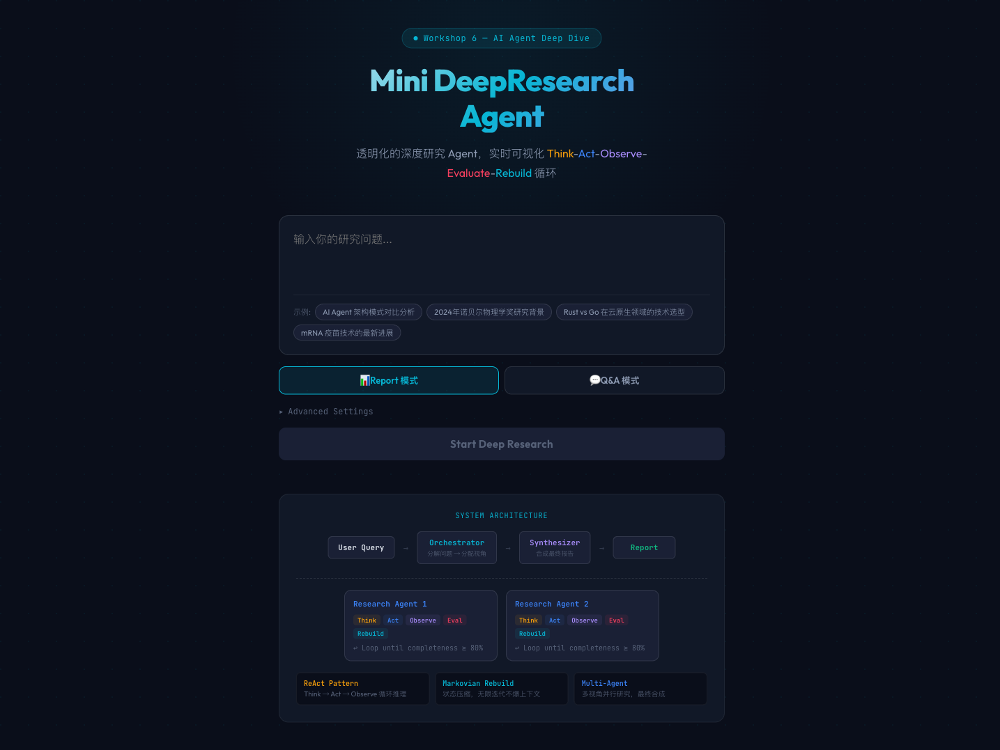
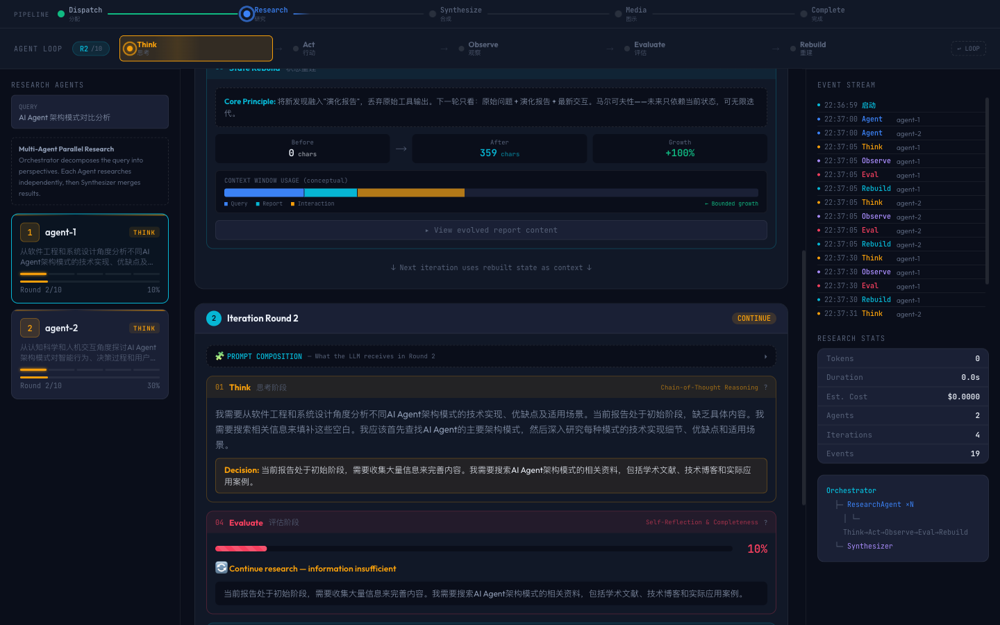
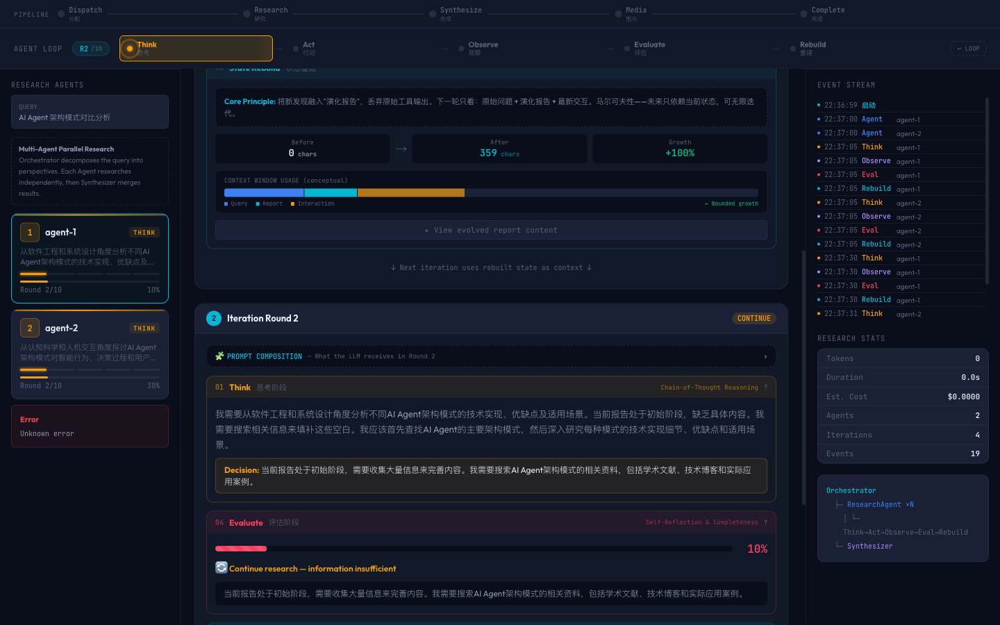
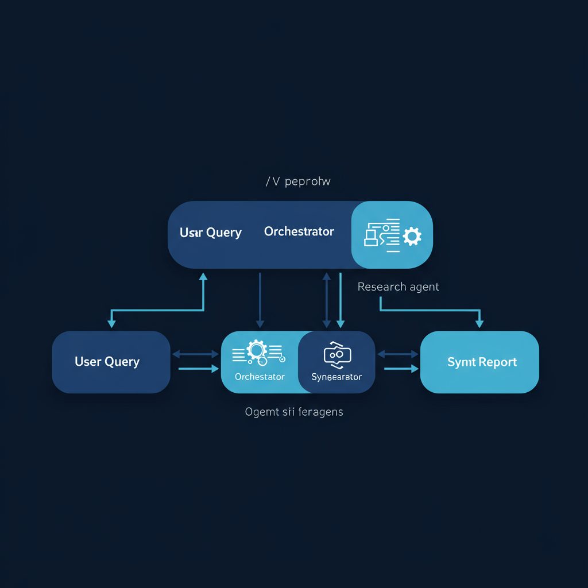
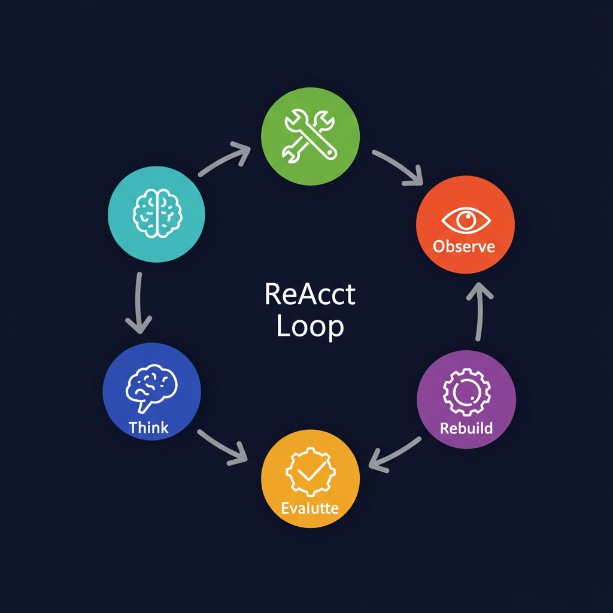
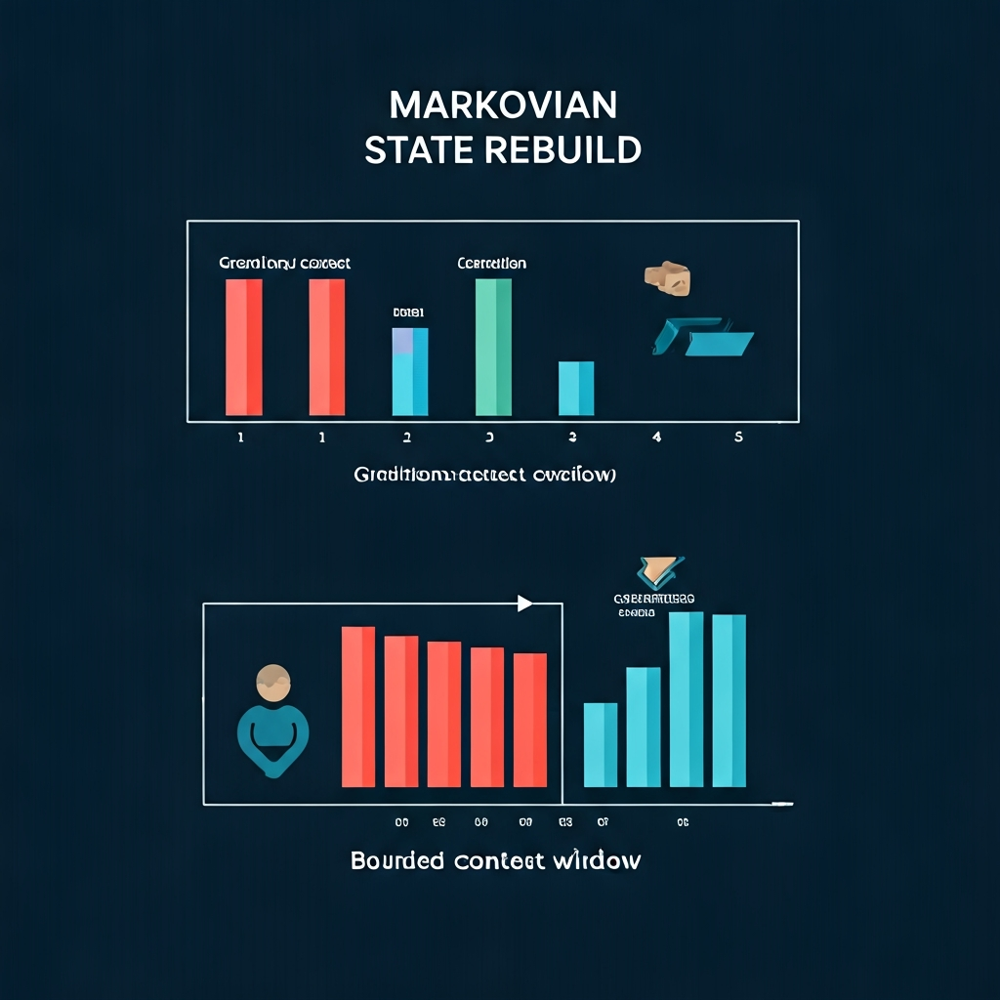
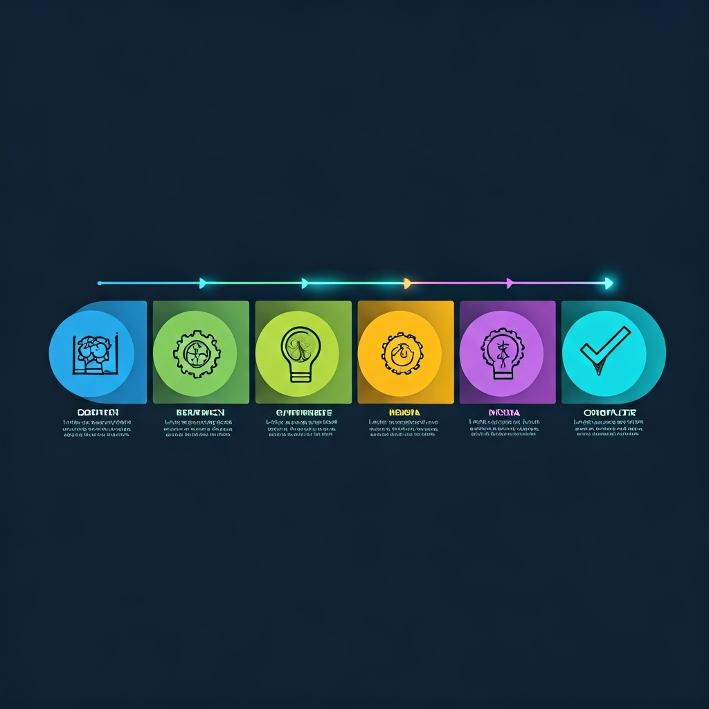

<div align="center">

# Mini DeepResearch Agent

**A transparent, educational deep research system for Workshop 6**

Multi-agent architecture with real-time visualization of the entire research pipeline.

[](https://deepresearch.rxcloud.group)
[](https://www.typescriptlang.org/)
[](https://react.dev/)
[](https://vite.dev/)
[](https://vercel.com)
[](LICENSE)

</div>

---

## What is Mini DeepResearch?

Mini DeepResearch is a **teaching-oriented** deep research agent that makes the "black box" of AI research transparent. Instead of just returning a final answer, it **visualizes every step** of the multi-agent research process in real time — from query decomposition, through parallel agent reasoning loops, to final report synthesis.

> **Workshop Goal**: Help students and developers understand how multi-agent systems, ReAct loops, and context management work under the hood.

---

## Screenshots

<table>
<tr>
<td width="50%">

### Landing Page
Configure your research query, mode (Report/Q&A), number of agents and iterations.



</td>
<td width="50%">

### Research Process
3-column layout: Agent cards | Thinking process | Event timeline



</td>
</tr>
<tr>
<td colspan="2">

### Pipeline & Agent Loop
5-stage pipeline progress bar + ReAct phase visualization + context window growth bar



</td>
</tr>
</table>

---

## Architecture

<div align="center">



</div>

```
User Query ──> Orchestrator ──> [ Agent 1 ]  [ Agent 2 ]  ...  [ Agent N ] ──> Synthesizer ──> Report
                                    │             │                 │
                               ReAct Loop    ReAct Loop        ReAct Loop
                           (Think─Act─Observe─Evaluate─Rebuild)
```

The **Orchestrator** decomposes the user query into multiple research perspectives, dispatches independent **Research Agents**, and collects their findings for synthesis. Each agent runs autonomously with its own ReAct loop and tools.

---

## Core Concepts

### 1. ReAct Loop (5 Phases)

<div align="center">



</div>

Each research agent iterates through a **5-phase reasoning loop**:

| Phase | What happens | Educational value |
|-------|-------------|-------------------|
| **Think** | LLM plans next research step | Shows Chain-of-Thought reasoning |
| **Act** | Calls tools (search, read, scholar) | Demonstrates tool-use / function calling |
| **Observe** | Processes tool results | Shows how agents parse external data |
| **Evaluate** | Self-reflects on completeness (0-100%) | Shows self-evaluation & stopping criteria |
| **Rebuild** | Compresses findings into evolving report | Shows Markovian state management |

### 2. Markovian State Rebuild

<div align="center">



</div>

Traditional agents accumulate **unbounded context** — each iteration adds more tokens until the context window overflows. Mini DeepResearch uses **Markovian State Rebuild**: after each iteration, the agent compresses all prior findings into a single evolving report, keeping the context window **bounded** regardless of iteration count.

```
Traditional:  [Query + Result₁ + Result₂ + Result₃ + ... + Resultₙ]  → overflow!
Markovian:    [Query + Compressed_Report + Latest_Result]              → bounded ✓
```

### 3. Research Pipeline

<div align="center">



</div>

The full pipeline progresses through 5 stages:

| Stage | Description |
|-------|-------------|
| **Dispatch** | Orchestrator decomposes query into sub-topics |
| **Research** | Agents run parallel ReAct loops |
| **Synthesize** | Merge agent reports into unified document |
| **Media** | Enrich report with Mermaid diagrams & AI images |
| **Complete** | Final report delivered |

---

## Key Features

| Feature | Description |
|---------|-------------|
| **Multi-Agent Parallel Research** | Orchestrator decomposes queries into perspectives, agents research independently |
| **5-Phase ReAct Loop** | Think, Act (tool calling), Observe, Evaluate (self-reflection), State Rebuild |
| **Markovian State Rebuild** | Bounded context growth via evolving report compression |
| **Real-time Visualization** | Pipeline progress, prompt composition, streaming indicators, loop diagrams |
| **Streaming LLM** | Token-level streaming keeps SSE connections alive, prevents serverless timeouts |
| **Multimedia Reports** | Mermaid diagrams (client-side), optional AI-generated images, rich Markdown |
| **Graceful Degradation** | Deadline mechanism, partial results, `Promise.allSettled` for agent failures |
| **Educational UX** | Auto-expanding concept explanations, phase annotations, context window bar |

---

## Educational Design

This project is purpose-built for **teaching AI agent concepts**. Key educational features:

| Feature | What students learn |
|---------|-------------------|
| **Prompt Composition Panel** | Exactly what the LLM receives each round — demystifies prompt engineering |
| **Context Window Bar** | Visualizes bounded growth from Markovian state rebuild |
| **Phase Annotations** | Each phase has expandable concept explanations (ReAct, CoT, etc.) |
| **Pipeline Progress** | How multi-stage orchestration works |
| **Streaming Indicator** | Live token generation with character count |
| **Auto-Expanding Hints** | First-visit progressive disclosure for key concepts |

---

## Tech Stack

| Layer | Technology |
|-------|-----------|
| Frontend | React 19, Vite 6, React Router, Mermaid.js, DOMPurify |
| Backend | TypeScript, Vercel Serverless Functions |
| LLM | Volcengine Ark CodingPlan (OpenAI-compatible API) |
| Search | Tavily API |
| Web Reader | Jina Reader API |
| Scholar | Serper API |
| Images | Optional image provider, disabled unless configured |
| Deployment | Vercel (Hobby / Pro) |

---

## Project Structure

```
api/
  research.ts              # Vercel serverless SSE endpoint
src/
  agent/
    research-agent.ts      # ReAct loop agent with streaming & deadline
  orchestrator/
    orchestrator.ts        # Multi-agent coordination + synthesis
    synthesizer.ts         # Report merging with visual content
  llm/
    client.ts              # Streaming LLM client (OpenAI-compatible)
  tools/
    search.ts              # Tavily search tool
    visit.ts               # Jina web reader tool
    scholar.ts             # Serper scholar tool
  tracer/
    tracer.ts              # Execution trace recorder
web/
  src/
    pages/
      HomePage.tsx         # Landing page with interactive architecture diagram
      ResearchPage.tsx     # Main research UI with 3-column layout
    components/
      ThinkingProcess.tsx  # Educational phase visualization with auto-expand
      LoopDiagram.tsx      # Animated ReAct loop diagram
      AgentCard.tsx        # Agent sidebar with progress & streaming indicator
      ReportRenderer.tsx   # Markdown + Mermaid report display
      MermaidBlock.tsx     # Safe Mermaid diagram rendering
      TraceTimeline.tsx    # Event timeline with auto-scroll
docs/
  diagrams/                # AI-generated concept diagrams
  screenshots/             # Live demo screenshots
```

---

## Getting Started

### Prerequisites

- Node.js 18+
- API keys: Volcengine Ark (LLM), Tavily (search), Jina (web reader)

### Setup

```bash
# Install dependencies
npm install && cd web && npm install && cd ..

# Configure environment
cp .env.example .env
# Edit .env with your API keys

# Run locally
npm run dev:web    # Frontend (Vite dev server)
npm run dev        # Backend (if running standalone)
```

### Deploy to Vercel

```bash
vercel deploy
```

Set environment variables in Vercel dashboard:

| Variable | Value |
|----------|-------|
| `ARK_API_KEY` | Volcengine Ark API key |
| `ARK_BASE_URL` | `https://ark.cn-beijing.volces.com/api/coding/v3` |
| `ARK_CHAT_MODEL` | `doubao-seed-2-0-code-preview-260215` |
| `TAVILY_API_KEY` | Tavily search API key |
| `JINA_API_KEY` | Jina reader API key |
| `SERPER_API_KEY` | (optional) Serper scholar API key |
| `ARK_IMAGE_API_KEY` / `ARK_IMAGE_BASE_URL` / `ARK_IMAGE_MODEL` | Optional image provider; leave unset unless verified |
| `ARK_VIDEO_API_KEY` / `ARK_VIDEO_BASE_URL` / `ARK_VIDEO_MODEL` | Optional video provider; leave unset unless verified |
| `FUNCTION_TIMEOUT` | `60` (Hobby) or `300` (Pro plan) |

---

## How It Works (Technical Deep Dive)

### SSE Streaming Architecture

```
Browser ←──SSE──← Vercel Serverless ←──Stream──← LLM API
                       │
                  AbortController (deadline)
                       │
                  Heartbeat keepalive (every 15s)
```

- **Token-level streaming**: Each LLM token is forwarded as an SSE event, preventing Vercel's response timeout
- **Deadline mechanism**: `AbortController` with configurable `FUNCTION_TIMEOUT` auto-caps iterations when time runs low
- **Heartbeat**: Periodic keepalive events prevent proxy/CDN idle disconnects

### Agent Failure Handling

```typescript
// Agents run with Promise.allSettled — partial results are preserved
const results = await Promise.allSettled(agents.map(a => a.research()));
// Even if 2/3 agents fail, the surviving agent's report is synthesized
```

- `Promise.allSettled` ensures partial results are always returned
- Error classification (network / timeout / API / unknown) with retry UI
- Auto-capped iterations based on remaining time budget

---

## License

MIT
